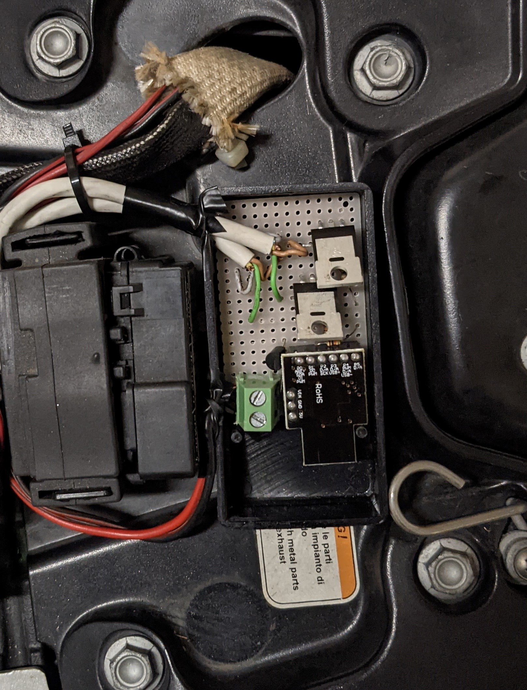

# progressiveIndicators
Additional progressive turn indicators for motorbikes and cars.
&nbsp;

## System
Digispark microcontroller connected to the two turn signals coming from the vehicle (through nmos transistors) and to two addressable LED strips.
&nbsp;
&nbsp;

&nbsp;
&nbsp;
(-), (+) and (Di) refer to the two LED strips; right and left INDICATOR labels come from the vehicle and all the other labels are Digispark's pins.
&nbsp;
&nbsp;
In the picture below there is an overview of the circuit (indicator wires are hidden under the white cables and reach the back of the board).
It is still under development (you can see additional transitor and resistances), the goal is to get a PCB and make it waterproof using epoxy.
&nbsp;
&nbsp;

## Code
Arduino code to handle the inputs and trigger the related strip animation (using Adafruit_NeoPixel simple library).

# Demo
Here, a little video is available, to understand the behavior.
&nbsp;
&nbsp;

