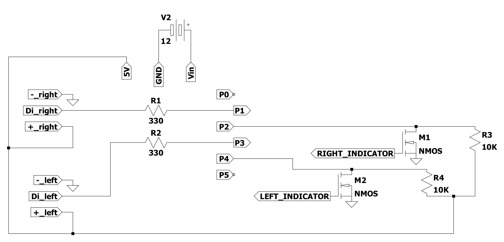

# progressiveIndicators
Additional progressive turn indicators for motorbikes and cars.

## System
Digispark microcontroller connected to the two turn signals coming from the vehicle (through nmos transistors) and to two addressable LED strips.

## Code
Arduino code to handle the inputs and trigger the related strip animation (using Adafruit_NeoPixel simple library).

# Demo
Here, a little video is available, to understand the behavior.

